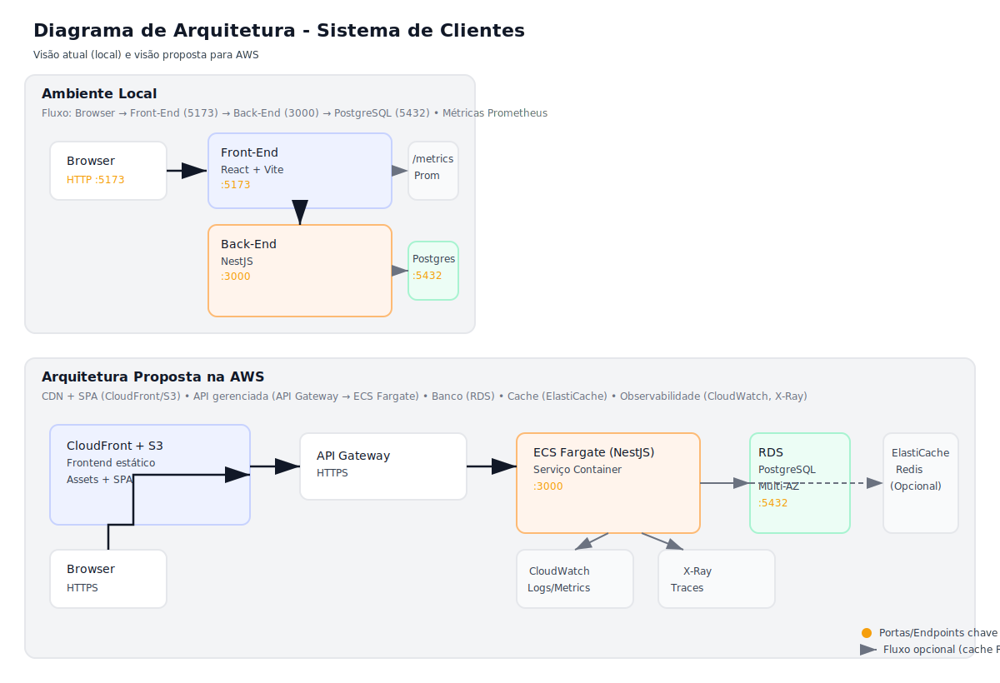

# Sistema de Clientes - MVP Full-Stack

Sistema completo de gerenciamento de clientes com autenticação, CRUD, dashboard administrativo e observabilidade.

## Ambiente para teste online

Acesse: https://alertapx.com/
> Esta aplicação está rodando em uma instância AWS EC2. O frontend está exposto na porta 5173 e o backend na porta 3000 conforme a configuração de Docker Compose.

## 📋 Visão Geral

Este projeto é um MVP full-stack desenvolvido como monorepo usando **Nx.dev**, contendo:

- **Front-End**: React + Vite + TypeScript
- **Back-End**: NestJS + TypeORM + PostgreSQL
- **Autenticação**: JWT
- **Observabilidade**: Logs estruturados, healthcheck e métricas Prometheus
- **Containerização**: Docker e Docker Compose

## 🎨 Design

O layout do front-end foi desenvolvido seguindo o design fornecido no Figma:

🔗 **[Design no Figma](https://www.figma.com/design/HIy3zEOdvNhK4ysAdNSKXR/Teste-Front-End-Desktop---Teddy?node-id=2-466&p=f)**

### Características do Design Implementado

#### Header/Topbar
- **Altura fixa de 70px** com fundo branco e sombra sutil
- **Logo "Teddy Open Finance"** com "Teddy" em laranja (#F36B21) e "Open Finance" em cinza
- **Menu hambúrguer** (visível apenas em mobile) para abrir sidebar de navegação
- **Navegação centralizada** com links: Clientes, Clientes selecionados, Sair
- **Indicador de rota ativa** com sublinhado laranja animado
- **Saudação do usuário** à direita ("Olá, Usuário!")

#### Página de Clientes
- **Header com contador**: "X clientes encontrados"
- **Dropdown de paginação**: "Clientes por página" (8, 16, 24, 32)
- **Grid responsivo**: 4 colunas (desktop), 3 (tablet), 2 (mobile médio), 1 (mobile)
- **Cards de clientes** com:
  - Nome do cliente em destaque
  - Salário formatado em R$
  - Valor da empresa formatado em R$
  - Ícones de ação: + (adicionar), ✏️ (editar), 🗑️ (excluir)
- **Botão "Criar cliente"** centralizado com borda laranja
- **Paginação** com números e elipses, página ativa destacada em laranja
- **Animações suaves** em hover, transições de página e carregamento de cards

#### Responsividade
- **Desktop (>968px)**: Grid de 4 colunas, navegação horizontal visível
- **Tablet (768px-968px)**: Grid de 2-3 colunas, menu hambúrguer ativo
- **Mobile (<768px)**: Grid de 1 coluna, sidebar de navegação

#### Animações e Interações
- Transições suaves em hover (cards, botões, ícones)
- Animação de fade-in ao carregar páginas
- Animação escalonada dos cards (stagger effect)
- Efeitos de bounce e scale em interações
- Scroll suave ao trocar de página
- Rotação do ícone "+" quando cliente é selecionado

#### Acessibilidade
- Tooltips em todos os ícones de ação
- aria-labels em botões importantes
- Focus visible com outline laranja
- Navegação por teclado funcional
- Contraste adequado de cores

## 🏗️ Arquitetura

## 🗺️ Diagrama de Arquitetura



### Visão Local

```
┌─────────────┐
│   Browser   │
│  :5173      │
└──────┬──────┘
       │
       ▼
┌─────────────┐
│  Front-End  │
│  React+Vite │
└──────┬──────┘
       │ HTTP/REST
       ▼
┌─────────────┐
│  Back-End   │
│   NestJS    │
│   :3000     │
└──────┬──────┘
       │
       ├──► PostgreSQL :5432
       │
       └──► Prometheus Metrics
```

### Visão AWS (Proposta)

```
┌─────────────────────────────────────────────────────────┐
│                      AWS Cloud                          │
│                                                         │
│  ┌──────────────┐         ┌──────────────┐            │
│  │   CloudFront │         │  API Gateway │            │
│  │   (CDN)      │         │             │            │
│  └──────┬───────┘         └──────┬───────┘            │
│         │                        │                    │
│         ▼                        ▼                    │
│  ┌──────────────┐         ┌──────────────┐            │
│  │   S3 +       │         │  ECS Fargate │            │
│  │   CloudFront │         │  (NestJS)    │            │
│  └──────────────┘         └──────┬───────┘            │
│                                   │                    │
│                          ┌────────┴────────┐           │
│                          │                 │           │
│                          ▼                 ▼           │
│                   ┌──────────────┐  ┌──────────────┐  │
│                   │   RDS        │  │  ElastiCache │  │
│                   │  PostgreSQL  │  │   (Redis)    │  │
│                   └──────────────┘  └──────────────┘  │
│                                                       │
│  ┌──────────────┐         ┌──────────────┐            │
│  │  CloudWatch  │         │  X-Ray       │            │
│  │  (Logs)      │         │  (Traces)    │            │
│  └──────────────┘         └──────────────┘            │
└─────────────────────────────────────────────────────────┘
```

### Escalabilidade

A arquitetura proposta na AWS permite escalabilidade horizontal através de:

1. **CloudFront + S3**: CDN para servir o front-end estático com cache global
2. **ECS Fargate**: Containerização permite escalar automaticamente baseado em carga
3. **RDS PostgreSQL**: Banco gerenciado com read replicas para alta disponibilidade
4. **ElastiCache Redis**: Cache distribuído para sessões e dados frequentes
5. **API Gateway**: Gerenciamento de APIs com rate limiting e throttling
6. **CloudWatch + X-Ray**: Observabilidade completa com logs, métricas e traces

## 🚀 Início Rápido

### Pré-requisitos

- Node.js 18+
- Docker e Docker Compose
- PostgreSQL 15+ (se rodar localmente sem Docker)

### Instalação

1. Clone o repositório:
```bash
git clone <repo-url>
cd desafio
```

2. Instale as dependências:
```bash
npm install
cd apps/front-end && npm install
cd ../back-end && npm install
```

### Executar com Docker (Recomendado)

#### Front-End isolado:
```bash
cd apps/front-end
docker-compose up
```

#### Back-End isolado:
```bash
cd apps/back-end
docker-compose up
```

### Executar Localmente

#### Back-End:
```bash
cd apps/back-end
cp .env.example .env
# Configure o .env com suas credenciais do PostgreSQL
npm run migration:run
npm run start:dev
```

#### Front-End:
```bash
cd apps/front-end
cp .env.example .env
npm run dev
```

## 📚 Documentação

### Front-End
- [README do Front-End](apps/front-end/README.md)
- URL: http://localhost:5173

### Back-End
- [README do Back-End](apps/back-end/README.md)
- API: http://localhost:3000
- Swagger: http://localhost:3000/docs
- Healthcheck: http://localhost:3000/healthz
- Métricas: http://localhost:3000/metrics

## 🔐 Credenciais Padrão

- **Email**: `admin@example.com`
- **Senha**: `admin123`

## 🧪 Testes

### Front-End
```bash
cd apps/front-end
npm run test
npm run test:coverage
```

### Back-End
```bash
cd apps/back-end
npm run test
npm run test:cov
npm run test:e2e
```

## 📦 Estrutura do Projeto

```
desafio/
├── apps/
│   ├── front-end/          # React + Vite + TS
│   │   ├── src/
│   │   │   ├── app/        # Rotas e layouts
│   │   │   ├── features/   # Features (auth, clients, dashboard)
│   │   │   └── shared/     # Componentes e libs compartilhadas
│   │   ├── docker-compose.yml
│   │   └── README.md
│   │
│   └── back-end/           # NestJS + TypeORM + PostgreSQL
│       ├── src/
│       │   ├── auth/       # Módulo de autenticação
│       │   ├── clients/    # Módulo de clientes
│       │   ├── dashboard/  # Dashboard/Admin
│       │   ├── metrics/    # Contador de views
│       │   └── migrations/ # Migrações do banco
│       ├── docker-compose.yml
│       └── README.md
│
├── .github/
│   └── workflows/          # CI/CD pipelines
│
└── README.md               # Este arquivo
```

## 🔗 Endpoints da API

### Autenticação
- `POST /auth/login` - Login com email/senha

### Clientes (requer autenticação)
- `POST /clients` - Criar cliente
- `GET /clients` - Listar clientes
- `GET /clients/:id` - Detalhes do cliente (incrementa contador)
- `PUT /clients/:id` - Atualizar cliente
- `DELETE /clients/:id` - Excluir cliente (soft delete)

### Dashboard (requer autenticação)
- `GET /dashboard/stats` - Estatísticas do dashboard

### Sistema
- `GET /healthz` - Healthcheck
- `GET /metrics` - Métricas Prometheus
- `GET /docs` - Documentação Swagger

## 📊 Observabilidade

### Logs Estruturados
Os logs são gerados em formato JSON usando Winston, facilitando:
- Parsing e análise automatizada
- Integração com sistemas de log (CloudWatch, ELK, etc.)
- Rastreamento de erros e performance

### Healthcheck
O endpoint `/healthz` retorna:
- Status da aplicação
- Timestamp
- Uptime

### Métricas Prometheus
O endpoint `/metrics` expõe métricas no formato Prometheus:
- Contador de views por cliente
- Métricas customizadas da aplicação

## 🛠️ Tecnologias

### Front-End
- React 18
- Vite
- TypeScript
- React Router
- React Hook Form + Zod
- Axios
- Recharts
- Vitest

### Back-End
- NestJS
- TypeORM
- PostgreSQL
- JWT (Passport)
- Swagger/OpenAPI
- Winston (Logs)
- Prometheus (Métricas)
- Jest

### DevOps
- Docker
- Docker Compose
- GitHub Actions
- Nx.dev

## 📝 Commits Semânticos

Este projeto segue o padrão de commits semânticos:
- `feat:` Nova funcionalidade
- `fix:` Correção de bug
- `docs:` Documentação
- `style:` Formatação
- `refactor:` Refatoração
- `test:` Testes
- `chore:` Manutenção

## 🤝 Contribuindo

1. Faça fork do projeto
2. Crie uma branch para sua feature (`git checkout -b feature/AmazingFeature`)
3. Commit suas mudanças (`git commit -m 'feat: Add some AmazingFeature'`)
4. Push para a branch (`git push origin feature/AmazingFeature`)
5. Abra um Pull Request

## 📄 Licença

Este projeto foi desenvolvido como parte de um desafio técnico.

## 🎯 Funcionalidades Implementadas

✅ Autenticação JWT  
✅ CRUD completo de clientes  
✅ Soft delete  
✅ Dashboard com estatísticas  
✅ Gráfico de clientes por mês  
✅ Contador de visualizações  
✅ Auditoria com timestamps  
✅ Logs estruturados  
✅ Healthcheck  
✅ Métricas Prometheus  
✅ Swagger/OpenAPI  
✅ Testes unitários  
✅ CI/CD com GitHub Actions  
✅ Docker e Docker Compose  
✅ Documentação completa  

## 🚧 Melhorias Futuras

- [ ] Testes E2E completos
- [ ] Cache com Redis
- [ ] Rate limiting
- [ ] Upload de arquivos
- [ ] Notificações em tempo real
- [ ] Deploy automatizado
- [ ] Monitoramento com Grafana
- [ ] Traces com OpenTelemetry

